# Mapa de Navegación y Casos de Uso — SkillSwap

---

## 1. Diagrama de Navegación

```mermaid
flowchart TD
    START([🌐 Visitante\naccede a la app])

    %% Páginas principales
    HOME["🏠 Home\n/"]
    LOGIN["🔑 Login\n/login"]
    REGISTER["📝 Register\n/register"]
    CATALOG["📚 Catálogo\n/catalog"]
    SKILL_DETAIL["🔍 Detalle Skill\n/skill/:id"]
    PUBLIC_PROFILE["👤 Perfil Público\n/profile/:id"]
    DASHBOARD["🖥️ Dashboard\n/dashboard"]
    MESSAGES["💬 Chat\n/messages/:id"]
    ADMIN["🛡️ Admin Panel\n/admin"]

    %% Modales del Dashboard
    MODAL_PUBLISH["📋 Modal:\nPublicar Habilidad"]
    MODAL_CALENDAR["📅 Modal:\nAgendar Disponibilidad"]
    MODAL_SETTINGS["⚙️ Modal:\nAjustes de Perfil"]
    MODAL_RESCHEDULE["🔄 Modal:\nReprogramar Clase"]
    MODAL_REVIEW["⭐ Modal:\nCalificar Intercambio"]

    %% Modal Skill Detail
    MODAL_REQUEST["📨 Modal:\nProponer Intercambio"]

    %% Servicios externos
    JITSI["🎥 Jit.si\nAula Virtual"]
    GCAL["📆 Google Calendar"]
    SUPABASE_AUTH["🔐 Supabase Auth\nGoogle OAuth"]

    %% ── Punto de entrada ──
    START --> HOME

    %% ── Home ──
    HOME -->|"Únete a la comunidad\n(sin sesión)"| REGISTER
    HOME -->|"Explorar habilidades\n(sin sesión)"| CATALOG
    HOME -->|"Ir a mi Panel\n(con sesión)"| DASHBOARD
    HOME -->|"Buscar nuevos intercambios\n(con sesión)"| CATALOG

    %% ── Navbar ──
    HOME & LOGIN & REGISTER & CATALOG & SKILL_DETAIL & PUBLIC_PROFILE & DASHBOARD & MESSAGES & ADMIN -->|"Click logo o navlink Home"| HOME
    HOME & LOGIN & REGISTER & CATALOG & SKILL_DETAIL & PUBLIC_PROFILE & DASHBOARD & MESSAGES & ADMIN -->|"Explorar (Navbar)"| CATALOG
    HOME & LOGIN & REGISTER & CATALOG & SKILL_DETAIL & PUBLIC_PROFILE & MESSAGES & ADMIN -->|"Mi Panel (Navbar)"| DASHBOARD
    HOME & LOGIN & REGISTER & CATALOG & SKILL_DETAIL & PUBLIC_PROFILE & DASHBOARD & MESSAGES & ADMIN -->|"Panel Admin (Navbar)\n[admin/mod]"| ADMIN
    HOME & CATALOG & SKILL_DETAIL & PUBLIC_PROFILE & DASHBOARD & MESSAGES & ADMIN -->|"Salir (logout)"| HOME
    HOME & CATALOG & SKILL_DETAIL & PUBLIC_PROFILE & DASHBOARD & MESSAGES & ADMIN -->|"Click notificación\ncon link"| MESSAGES

    %% ── Login ──
    LOGIN -->|"Submit email+pass\nOAuth Google → redirige"| DASHBOARD
    LOGIN -->|"Registrarse aquí"| REGISTER
    LOGIN -->|"Google → popup"| SUPABASE_AUTH
    SUPABASE_AUTH -->|"Autenticación exitosa"| DASHBOARD

    %% ── Register ──
    REGISTER -->|"Submit formulario"| DASHBOARD
    REGISTER -->|"Ya tenés cuenta → Inicia sesión"| LOGIN
    REGISTER -->|"Google OAuth"| SUPABASE_AUTH

    %% ── Catálogo ──
    CATALOG -->|"Click card skill"| SKILL_DETAIL
    CATALOG -->|"Click nombre propietario\nen card"| PUBLIC_PROFILE

    %% ── Detalle de Skill ──
    SKILL_DETAIL -->|"Click Volver"| CATALOG
    SKILL_DETAIL -->|"Click nombre propietario"| PUBLIC_PROFILE
    SKILL_DETAIL -->|"Solicitar Intercambio\n(sin sesión)"| LOGIN
    SKILL_DETAIL -->|"Solicitar Intercambio\n(con sesión + créditos)"| MODAL_REQUEST
    MODAL_REQUEST -->|"Confirmar Envío\n(éxito)"| CATALOG
    MODAL_REQUEST -->|"Cancelar"| SKILL_DETAIL
    SKILL_DETAIL -->|"Borrar Habilidad\n(propietario)"| DASHBOARD
    SKILL_DETAIL -->|"Borrar Habilidad\n(admin/mod)"| CATALOG

    %% ── Perfil Público ──
    PUBLIC_PROFILE -->|"Click Volver"| CATALOG
    PUBLIC_PROFILE -->|"Click skill card"| SKILL_DETAIL
    PUBLIC_PROFILE -->|"Perfil no encontrado\n→ Volver al catálogo"| CATALOG

    %% ── Dashboard: Solicitudes ──
    DASHBOARD -->|"Aceptar solicitud entrante"| MESSAGES
    DASHBOARD -->|"Click 💬 (solicitud aceptada)"| MESSAGES
    DASHBOARD -->|"Publicar Habilidad"| MODAL_PUBLISH
    MODAL_PUBLISH -->|"Agendar disponibilidad"| MODAL_CALENDAR
    MODAL_CALENDAR -->|"Confirmar Disponibilidad"| MODAL_PUBLISH
    MODAL_CALENDAR -->|"Cancelar"| MODAL_PUBLISH
    MODAL_PUBLISH -->|"Publicar (submit)"| DASHBOARD
    MODAL_PUBLISH -->|"Cerrar / X"| DASHBOARD

    %% ── Dashboard: Ajustes ──
    DASHBOARD -->|"Click ⚙️ Ajustes"| MODAL_SETTINGS
    MODAL_SETTINGS -->|"Guardar Ajustes"| DASHBOARD
    MODAL_SETTINGS -->|"Cancelar"| DASHBOARD

    %% ── Dashboard: Intercambios ──
    DASHBOARD -->|"Seleccionar día en calendario"| DASHBOARD
    DASHBOARD -->|"Marcar Completada"| MODAL_REVIEW
    DASHBOARD -->|"Reprogramar"| MODAL_RESCHEDULE
    MODAL_RESCHEDULE -->|"Confirmar Cambio"| DASHBOARD
    MODAL_RESCHEDULE -->|"Cancelar"| DASHBOARD
    MODAL_REVIEW -->|"Enviar Calificación / Omitir"| DASHBOARD
    DASHBOARD -->|"Entrar al Aula Virtual"| JITSI
    DASHBOARD -->|"Añadir a Google Calendar"| GCAL

    %% ── Chat ──
    MESSAGES -->|"Click Volver ←"| DASHBOARD

    %% ── Admin ──
    ADMIN -->|"Usuario sin rol admin/mod\n→ redirige"| HOME

    %% ── Rutas desconocidas ──
    UNKNOWN["❓ Ruta\nDesconocida /*"]
    UNKNOWN -->|"Catch-all redirect"| HOME
```

---

## 2. Tabla de Transiciones de Navegación

Todas las transiciones detectadas en el código fuente:

| # | Pantalla Origen | Acción del usuario | Pantalla Destino | Condición |
|---|---|---|---|---|
| 1 | Home | Clic "Únete a la comunidad" | Register `/register` | Sin sesión |
| 2 | Home | Clic "Explorar habilidades" | Catálogo `/catalog` | Sin sesión |
| 3 | Home | Clic "Ir a mi Panel" | Dashboard `/dashboard` | Con sesión |
| 4 | Home | Clic "Buscar nuevos intercambios" | Catálogo `/catalog` | Con sesión |
| 5 | Login | Submit email + contraseña | Dashboard `/dashboard` | Credenciales válidas |
| 6 | Login | Clic Google OAuth | Supabase Auth → Dashboard | — |
| 7 | Login | Clic "Regístrate aquí" | Register `/register` | — |
| 8 | Register | Submit formulario | Dashboard `/dashboard` | Datos válidos |
| 9 | Register | Clic Google OAuth | Supabase Auth → Dashboard | — |
| 10 | Register | Clic "Inicia sesión" | Login `/login` | — |
| 11 | Navbar (cualquier página) | Clic logo / "SkillSwap" | Home `/` | — |
| 12 | Navbar | Clic "Explorar" | Catálogo `/catalog` | — |
| 13 | Navbar | Clic "Mi Panel" | Dashboard `/dashboard` | Con sesión |
| 14 | Navbar | Clic "Panel Admin" | Admin `/admin` | Rol admin o moderator |
| 15 | Navbar | Clic "Salir" | Home `/` | Con sesión → cierra sesión |
| 16 | Navbar | Clic notificación con link | Chat `/messages/:id` | Con sesión, notif con link |
| 17 | Catálogo | Clic card de habilidad | Detalle Skill `/skill/:id` | — |
| 18 | Catálogo | Clic nombre del propietario | Perfil Público `/profile/:id` | — |
| 19 | Detalle Skill | Clic "Volver" | Página anterior | `navigate(-1)` |
| 20 | Detalle Skill | Clic nombre del propietario | Perfil Público `/profile/:id` | — |
| 21 | Detalle Skill | Clic "Solicitar Intercambio" | Login `/login` | Sin sesión |
| 22 | Detalle Skill | Clic "Solicitar Intercambio" | Modal de propuesta | Con sesión + créditos > 0 |
| 23 | Detalle Skill | Clic "Solicitar Intercambio" | Alert (sin créditos) | Con sesión, créditos = 0 |
| 24 | Modal Propuesta | Confirmar envío exitoso | Catálogo `/catalog` | Solicitud enviada |
| 25 | Modal Propuesta | Clic "Cancelar" | Detalle Skill (cierra modal) | — |
| 26 | Detalle Skill | Clic "Borrar Habilidad" + confirmar | Dashboard `/dashboard` | Propietario de la skill |
| 27 | Detalle Skill | Clic "Borrar Habilidad" + confirmar | Catálogo `/catalog` | Admin o moderator |
| 28 | Perfil Público | Clic "Volver" | Página anterior | `navigate(-1)` |
| 29 | Perfil Público | Clic card de habilidad | Detalle Skill `/skill/:id` | — |
| 30 | Perfil Público | Clic "Volver al catálogo" (perfil 404) | Catálogo `/catalog` | Perfil no encontrado |
| 31 | Dashboard | Clic "Publicar Habilidad" | Modal Publicar (en página) | Con sesión |
| 32 | Dashboard | Clic "Agendar disponibilidad" | Modal Calendario (sub-modal) | Dentro de modal publicar |
| 33 | Dashboard | Confirmar disponibilidad | Modal Publicar (con disponibilidad) | — |
| 34 | Dashboard | Submit "Publicar Habilidad" | Dashboard (recarga lista) | Skill guardada |
| 35 | Dashboard | Clic ⚙️ Ajustes de Perfil | Modal Settings (en página) | Con sesión |
| 36 | Dashboard | Guardar ajustes | Dashboard (cierra modal) | Datos válidos |
| 37 | Dashboard | Clic "Aceptar" solicitud entrante | Chat `/messages/:id` | Status → accepted |
| 38 | Dashboard | Clic 💬 (solicitud aceptada, recibida) | Chat `/messages/:id` | — |
| 39 | Dashboard | Clic 💬 (solicitud aceptada, enviada) | Chat `/messages/:id` | — |
| 40 | Dashboard | Clic "Marcar como Completada" | Modal Review (en página) | Clase activa |
| 41 | Dashboard | Clic "Dejar Calificación" | Modal Review (en página) | Clase completada sin review |
| 42 | Dashboard | Clic "Reprogramar" | Modal Reprogramar (en página) | Clase activa |
| 43 | Dashboard | Confirmar reprogramación | Dashboard (recarga clases) | — |
| 44 | Dashboard | Clic "Entrar al Aula Virtual" | Jit.si (nueva pestaña) | Clase virtual o híbrida activa |
| 45 | Dashboard | Clic "Añadir a Google Calendar" | Google Calendar (nueva pestaña) | Clase activa |
| 46 | Chat | Clic "← Volver" | Dashboard `/dashboard` | — |
| 47 | Admin Panel | Usuario sin rol requerido | Home `/` | Rol != admin y != moderator |
| 48 | Cualquier ruta desconocida | — | Home `/` | Catch-all `*` en router |
| 49 | AuthContext global | Cuenta suspendida (`is_banned`) | Pantalla de bloqueo | En cualquier punto de la app |
| 50 | AuthContext global | Supabase sin respuesta (>2 seg) | App cargada sin sesión | Timeout de fallback |

---

## 3. Casos de Uso Detectados en Código

### Módulo: Autenticación

| ID | Caso de Uso | Actor | Precondición | Flujo principal | Postcondición |
|---|---|---|---|---|---|
| UC-01 | Registrarse con email y contraseña | Visitante | No tiene cuenta | Completa formulario (nombre, apellido, email, contraseña, ciudad, categoría) → `supabase.auth.signUp` → INSERT en `profiles` | Usuario creado y autenticado, redirigido a `/dashboard` |
| UC-02 | Iniciar sesión con email y contraseña | Visitante | Tiene cuenta | Ingresa email y contraseña → `supabase.auth.signInWithPassword` → fetchProfile | Sesión activa, redirigido a `/dashboard` |
| UC-03 | Autenticarse con Google OAuth | Visitante | Tiene cuenta Google | Clic "Google" → `supabase.auth.signInWithOAuth` → callback → auto-crea perfil si no existe | Sesión activa, redirigido a `/dashboard` |
| UC-04 | Cerrar sesión | Usuario autenticado | Sesión activa | Clic "Salir" → `supabase.auth.signOut` → limpia estado | Estado de usuario nulo, redirigido a `/` |
| UC-05 | Mantenimiento de sesión | Sistema | App abierta en pestaña | `onAuthStateChange` + listener `focus` refresca JWT si expira en < 5 min | Sesión continuada sin intervención del usuario |
| UC-06 | Acceso bloqueado por suspensión | Sistema | Usuario con `is_banned = true` | Al cargar perfil, `AuthContext` detecta ban → muestra pantalla de bloqueo con botón "Cerrar Sesión" | Usuario no puede interactuar con la app |

---

### Módulo: Catálogo / Exploración

| ID | Caso de Uso | Actor | Precondición | Flujo principal | Postcondición |
|---|---|---|---|---|---|
| UC-07 | Explorar catálogo de habilidades | Visitante / Usuario | — | Accede a `/catalog` → se cargan todas las skills con rating promedio del propietario | Vista de grilla con cards de habilidades |
| UC-08 | Buscar habilidades por texto | Visitante / Usuario | Catálogo cargado | Escribe en input de búsqueda → filtro client-side sobre título y descripción | Lista filtrada en tiempo real |
| UC-09 | Filtrar por categoría | Visitante / Usuario | Catálogo cargado | Selecciona categoría en dropdown → filtro client-side | Lista filtrada por categoría |
| UC-10 | Aplicar filtros avanzados | Visitante / Usuario | Catálogo cargado | Clic "Filtros" → selecciona nivel, modalidad y/o ciudad → filtros combinados | Lista filtrada por múltiples criterios |
| UC-11 | Limpiar todos los filtros | Visitante / Usuario | Hay filtros activos | Clic "Limpiar" → resetea todos los estados de filtro | Lista completa de habilidades |

---

### Módulo: Habilidades (Skills)

| ID | Caso de Uso | Actor | Precondición | Flujo principal | Postcondición |
|---|---|---|---|---|---|
| UC-12 | Ver detalle de habilidad | Visitante / Usuario | — | Clic en card → `/skill/:id` → carga skill + reviews del propietario | Detalle completo con info del intercambio y valoraciones |
| UC-13 | Publicar nueva habilidad | Usuario | Sesión activa | Dashboard → "Publicar Habilidad" → completa formulario + disponibilidad → INSERT en `skills` | Nueva skill visible en catálogo |
| UC-14 | Agendar disponibilidad horaria | Usuario | Modal de publicación abierto | Abre sub-modal de calendario → selecciona fecha → define hora inicio y fin → añade slot → repite → confirma | Disponibilidad guardada como string formateado en el campo `availability` |
| UC-15 | Eliminar propia habilidad | Usuario | Es propietario de la skill | `/skill/:id` → "Borrar Habilidad" → confirma → DELETE en `skills` | Skill eliminada, redirigido a Dashboard |
| UC-16 | Eliminar habilidad ajena (moderación) | Admin / Moderator | Rol admin o moderator | Catálogo o detalle → "Eliminar publicación" → confirma → DELETE en `skills` | Skill eliminada, redirigido al catálogo |

---

### Módulo: Intercambios (Requests)

| ID | Caso de Uso | Actor | Precondición | Flujo principal | Postcondición |
|---|---|---|---|---|---|
| UC-17 | Solicitar intercambio de habilidad | Usuario | Sesión activa + `time_credits > 0` + no es propietario | `/skill/:id` → "Solicitar Intercambio" → modal → escribe mensaje → INSERT en `requests` (status: pending) | Solicitud enviada al propietario |
| UC-18 | Ver solicitudes recibidas | Usuario | Sesión activa | Dashboard → pestaña "Solicitudes Recibidas" → SELECT en `requests` donde `receiver_id = user.id` | Lista de solicitudes con estado y mensaje |
| UC-19 | Aceptar solicitud | Usuario | Es receptor de la solicitud + status = pending | Clic "Aceptar" → UPDATE `requests` (status: accepted) → parsea disponibilidad → INSERT en `classes` → navega a chat | Clases generadas, chat abierto |
| UC-20 | Rechazar solicitud | Usuario | Es receptor de la solicitud + status = pending | Clic "Rechazar" → UPDATE `requests` (status: rejected) | Solicitud rechazada, notificación al solicitante |
| UC-21 | Consultar estado de solicitudes enviadas | Usuario | Sesión activa | Dashboard → pestaña "Mis Solicitudes" → SELECT en `requests` donde `sender_id = user.id` | Lista con estado: pending / accepted / rejected |

---

### Módulo: Clases

| ID | Caso de Uso | Actor | Precondición | Flujo principal | Postcondición |
|---|---|---|---|---|---|
| UC-22 | Ver calendario de clases | Usuario | Sesión activa + tiene clases | Dashboard → pestaña "Mis Intercambios" → SELECT en `classes` | Calendario con puntos indicadores por rol |
| UC-23 | Consultar clases de un día | Usuario | Selecciona día en calendario | Clic en día → panel lateral muestra clases de esa fecha | Detalle de clases con acciones disponibles |
| UC-24 | Marcar clase como completada | Usuario (profesor o alumno) | Clase en estado activo | Clic "Marcar como Completada" + confirma → RPC `complete_class` → transfiere 1 crédito | Clase marcada `completed`, crédito transferido, modal de review si es alumno |
| UC-25 | Reprogramar clase | Usuario | Clase en estado activo | Clic "Reprogramar" → modal → nueva fecha + horario → UPDATE en `classes` (status: rescheduled) + mensaje al chat | Clase reprogramada, compañero notificado por chat |
| UC-26 | Cancelar clase | Usuario | Clase en estado activo | Clic "Cancelar" + confirma → UPDATE en `classes` (status: cancelled) + mensaje al chat | Clase cancelada, compañero notificado por chat |
| UC-27 | Unirse al aula virtual | Usuario | Clase virtual/híbrida activa | Clic "Entrar al Aula Virtual" → abre `meet.jit.si/SkillSwap_Class_{id}` en nueva pestaña | Sala de videoconferencia abierta |
| UC-28 | Añadir clase a Google Calendar | Usuario | Clase activa | Clic "Añadir a Google Calendar" → abre URL prefabricada con datos de la clase | Evento en Google Calendar del usuario |

---

### Módulo: Chat / Mensajes

| ID | Caso de Uso | Actor | Precondición | Flujo principal | Postcondición |
|---|---|---|---|---|---|
| UC-29 | Enviar mensaje en chat | Usuario | Solicitud aceptada, chat abierto | Escribe mensaje → submit → INSERT en `messages` (con optimistic update) | Mensaje visible en chat, notificado al receptor |
| UC-30 | Recibir mensaje en tiempo real | Usuario | Chat abierto | Supabase Realtime detecta INSERT en `messages` → actualiza lista + chime de audio | Mensaje nuevo visible sin recargar |
| UC-31 | Ver historial de mensajes | Usuario | Chat abierto | SELECT en `messages` donde `request_id = id` ordenado por `created_at ASC` | Historial completo del intercambio |

---

### Módulo: Valoraciones (Reviews)

| ID | Caso de Uso | Actor | Precondición | Flujo principal | Postcondición |
|---|---|---|---|---|---|
| UC-32 | Calificar al profesor | Usuario (alumno) | Clase completada + sin review previa | Modal → selecciona 1-5 estrellas + comentario opcional → INSERT en `reviews` | Valoración guardada, visible en perfil del profesor |
| UC-33 | Ver valoraciones de un usuario | Visitante / Usuario | Accede a perfil público | `/profile/:id` → pestaña "Valoraciones" → SELECT en `reviews` donde `reviewee_id = id` | Lista de reviews con avatar, estrellas y comentario |
| UC-34 | Ver valoraciones del propietario en habilidad | Visitante / Usuario | Accede a detalle de skill | SELECT en `reviews` donde `reviewee_id = owner_id` | Reviews del mentor directamente en la página del skill |

---

### Módulo: Perfil

| ID | Caso de Uso | Actor | Precondición | Flujo principal | Postcondición |
|---|---|---|---|---|---|
| UC-35 | Ver perfil público | Visitante / Usuario | — | `/profile/:id` → SELECT en `profiles` + skills + reviews | Perfil con datos, habilidades y valoraciones |
| UC-36 | Editar datos de perfil | Usuario | Sesión activa | Dashboard → ⚙️ → modal → modifica nombre/apellido/ciudad → UPDATE en `profiles` | Perfil actualizado |
| UC-37 | Cambiar avatar | Usuario | Modal de ajustes abierto | Selecciona avatar predefinido (DiceBear) o pega URL → UPDATE en `profiles.avatar_url` | Avatar actualizado en toda la app |
| UC-38 | Cambiar contraseña | Usuario | Modal de ajustes abierto | Ingresa nueva contraseña + confirmación → `supabase.auth.updateUser` | Contraseña actualizada en Supabase Auth |
| UC-39 | Buscar ciudad con autocompletado | Usuario | Modal de ajustes abierto | Escribe > 3 chars → fetch a Nominatim API → muestra sugerencias → selecciona | Campo ciudad actualizado con nombre normalizado |

---

### Módulo: Notificaciones

| ID | Caso de Uso | Actor | Precondición | Flujo principal | Postcondición |
|---|---|---|---|---|---|
| UC-40 | Recibir notificación en tiempo real | Usuario | Sesión activa | INSERT en `notifications` → Realtime → actualiza campana + toast flotante + chime | Badge de no leídas actualizado |
| UC-41 | Ver listado de notificaciones | Usuario | Sesión activa | Clic campana → dropdown con últimas 10 notificaciones | Panel de notificaciones visible |
| UC-42 | Marcar todas como leídas | Usuario | Hay notificaciones no leídas | Clic "Marcar leídas" → UPDATE `notifications` is_read=true | Badge desaparece |
| UC-43 | Navegar desde una notificación | Usuario | Notificación con campo `link` | Clic en notificación → marca como leída → `navigate(notif.link)` | Redirigido al chat u otra pantalla relevante |

---

### Módulo: Administración

| ID | Caso de Uso | Actor | Precondición | Flujo principal | Postcondición |
|---|---|---|---|---|---|
| UC-44 | Acceder al panel de administración | Admin / Moderator | Rol admin o moderator | Navbar → "Panel Admin" → `/admin` → SELECT en `profiles` (excepto propio) | Lista completa de usuarios de la plataforma |
| UC-45 | Suspender cuenta de usuario | Admin / Moderator | Usuario activo visible en tabla | Clic "Suspender Cuenta" + confirmar → UPDATE `profiles.is_banned = true` | Usuario bloqueado al siguiente carga |
| UC-46 | Levantar suspensión de usuario | Admin / Moderator | Usuario suspendido visible | Clic "Levantar Suspensión" + confirmar → UPDATE `profiles.is_banned = false` | Usuario puede volver a acceder |
| UC-47 | Cambiar rol de usuario | Admin / Moderator | Usuario visible en tabla | Dropdown de rol → selecciona `user` o `moderator` + confirma → UPDATE `profiles.role` | Rol actualizado (visible próxima vez que cargue) |
| UC-48 | Eliminar skill desde catálogo | Admin / Moderator | Skill visible en catálogo | Clic 🗑️ en card → confirma → DELETE en `skills` | Skill eliminada del catálogo |

---

## 4. Mapa de Permisos por Caso de Uso

| Módulo | UC ID | Visitante | User | Moderator | Admin |
|---|---|:---:|:---:|:---:|:---:|
| Auth | UC-01 a UC-06 | ✅/— | ✅ | ✅ | ✅ |
| Catálogo | UC-07 a UC-11 | ✅ | ✅ | ✅ | ✅ |
| Skills - Ver | UC-12 | ✅ | ✅ | ✅ | ✅ |
| Skills - Crear | UC-13, UC-14 | ❌ | ✅ | ✅ | ✅ |
| Skills - Borrar propia | UC-15 | ❌ | ✅ | ✅ | ✅ |
| Skills - Borrar ajena | UC-16, UC-48 | ❌ | ❌ | ✅ | ✅ |
| Intercambios | UC-17 a UC-21 | ❌ | ✅ | ✅ | ✅ |
| Clases | UC-22 a UC-28 | ❌ | ✅ | ✅ | ✅ |
| Chat | UC-29 a UC-31 | ❌ | ✅ | ✅ | ✅ |
| Reviews | UC-32 | ❌ | ✅ (alumno) | ✅ | ✅ |
| Reviews - Ver | UC-33, UC-34 | ✅ | ✅ | ✅ | ✅ |
| Perfil - Ver | UC-35 | ✅ | ✅ | ✅ | ✅ |
| Perfil - Editar | UC-36 a UC-39 | ❌ | ✅ (propio) | ✅ (propio) | ✅ (propio) |
| Notificaciones | UC-40 a UC-43 | ❌ | ✅ | ✅ | ✅ |
| Admin | UC-44 a UC-47 | ❌ | ❌ | ✅ | ✅ |

> **Total: 48 casos de uso identificados** — 6 Auth · 5 Catálogo · 5 Skills · 5 Requests · 7 Clases · 3 Chat · 3 Reviews · 5 Perfil · 4 Notificaciones · 5 Admin
